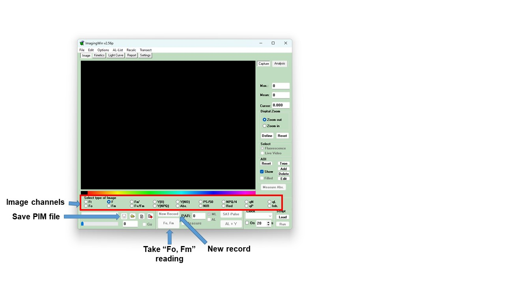
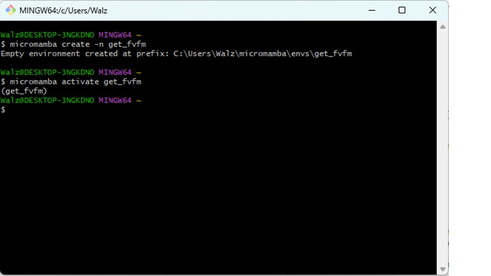
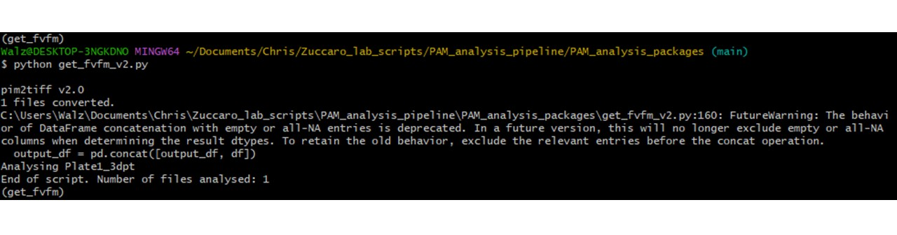
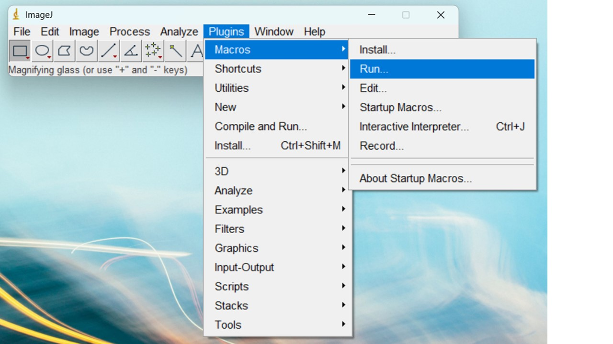
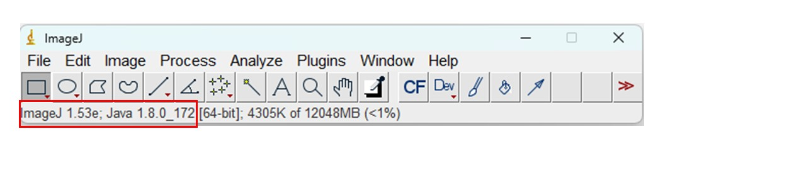
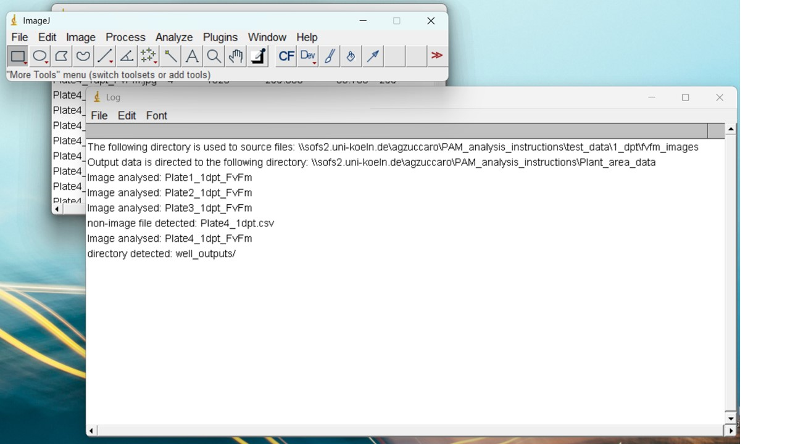
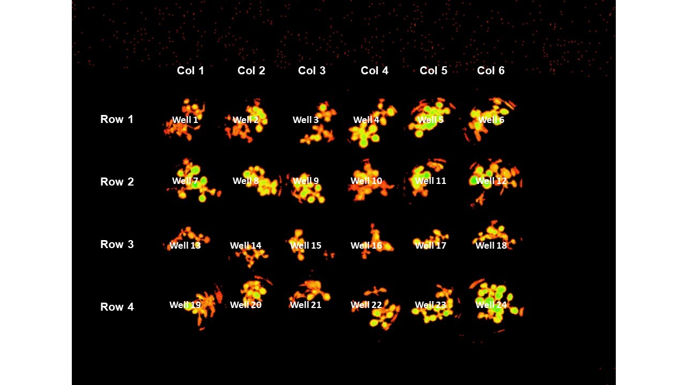

This document will guide you through the pipeline built for the semi-automated extraction of pulse amplitude modulation (PAM) fluorometry data from images generated using the PAM fluorometer:

- Using the Python script *get_fvfm.py* to extract FvFm data from .xpim files generated using the ImagingWin software.
- Using the ImageJ macro *Contrast_area_quant_directory.txt* to extract plant area data from "contrast" TIF images.
- Note: separate **options** in these scripts exist for the "**black plates**" - cell culture plates which do not result in internal reflection which may affect photosynthetic area quantification.

## Imaging 24-well plates to generate .xpim files

_Described previously by Nick. See also "How to use the PAM camera.docx"_



1\. **Check the magnification of the PAM imaging camera**. This is located on the top of the PAM instrument. The magnification settings should be as shown in the image below. Note: this is *very important*, as an incorrect magnification can affect all downstream stages of the data analysis!


1\. Place the 24-well plates to be imaged in the drawer under the PAM imager laptop (in the microscopy room, 4.302). Leave them in the dark for 15 minutes. There is a notice on the door to the microscopy room: "Plants in dark/PAM imaging". Post this on the outside of the door to notify others that you require the room to stay dark.

2\. After 15 minutes, turn on the power supply and light source to the PAM imager (units to the left of the laptop). The switch for the light source is on the back of the unit.

3\. Password for the computer is "12345". Open ImagingWin software and select "MAXI" setting.

***Carry out following stages in the dark to keep plants dark-adapted***

4\. Lift the red shield around the imaging platform. Transfer the first 24-well plate from the drawer to the platform.
 
 - Note: *Place the plates flush against the barriers at the back and right side of the platform, to ensure uniform well positioning. This is very important for automated downstream analysis!*

5\. Lower the red shield before imaging the plate.

6\. On the ImagingWin GUI page, there is a large "Fo, Fm" button (see image above). Click on this to take image measurements.

7\. Above the "Fo, Fm" button, there are a series of options for image channels. Click on the "Fv/Fm" channel. The plants should be clearly highlighted against a black background.
 
 - If the plants are not clearly highlighted, they may not be fully dark-adapted. Return the plate to the drawer for at least 10 minutes, then repeat above steps.

8\. Left of the "Fo, Fm" button is a "save" icon. Click on that to save the output as a PIM file.
 
 - Save the file in your own folder within the Data_MAXI folder. Once saved, a comment file will open automatically. This can be closed without adding a comment.

9\. Click on "New Record" button, immediately above "Fo, Fm". Answer "no" to the prompt to save image data.

- Note: Selecting "New Record" will delete any unsaved data from the ImagingWin memory. Make sure you save the image as a PIM file before carrying out this stage.

10\. Repeat steps 4 to 9 for all plates.

## Extract photosynthetic efficiency (Y(II)) data from PIM files
### Step 1: Installation and set-up

This step *only has to be carried out the first time you follow this protocol*. For repeat use of the pipeline, skip to ~~Part 2~~.

1\. Install Git. Go to https://git-scm.com/downloads and click the link for your operating system (e.g. Windows). Select the hyperlink at "Click here to download the latest...", to get the most up to date version. Select the recommended settings for the installation.

2\. Once installed, open Git bash (use the Windows search bar to find the program). This is the terminal for Git and should look similar to a regular Terminal/Command Prompt (see Figure 3). Now install "micromamba" (an "environment manager" program) by entering the following command:

```bash
"${SHELL}" <(curl -L micro.mamba.pm/install.sh)
```

- Note: you can check that micromamba is correctly installed by printing the micromamba help window using the `micromamba -h` command. 
- Note: Important commands for navigating in Git bash include "`pwd`" (provide working directory; the path to where you are currently located), "`dir`" (print the contents of your current location) and "`cd`" (change directory). To go "up" in the path from your current location, use "`cd ..`".

3\. Clone the PAM_analysis_pipeline repository from GitHub to your computer (this contains the scripts for the pipeline).

- Note: The script will run faster if you clone the repository to your local computer and run it there, rather than your own folder in the sofs drive.
- First, navigate in `git bash` to the location where you want to clone the repository (a new folder will be created called "PAM_analysis_pipeline"). For example, if you want to create that directory inside your "Documents/" folder, you can run this command:

```bash
cd $HOME/Documents/
## to check what is present inside your Documents folder, use the ls command
ls
ls -lrth # these added options will list the contents in anti-chronological order, with some other information
```
**NB**: `cd` stands for **c**hange **d**irectory, so it's a command to navigate between folders inside the command line. 

To clone the repository, simply run the following command in `git bash`:
```bash
git clone https://github.com/cstephens0991/PAM_Analysis_Pipeline
## check it was added:
ls -lrth 
# should list at the bottom, the PAM_Analysis_Pipeline folder
## move into that folder:
cd PAM_Analysis_Pipeline
```

Other commands which may be useful in navigating to your required directory include:

- `dir`: returns a list of all files and folders in your current directory
- `pwd`: returns the path to you current location
- `cd ..`: move up one level in the path (into the parent directory)

- Your current path location is also printed in yellow immediately above the command line. ```~``` (tilde) represents your home directory. You can check which directory this is using `echo $HOME`.

- When writing directory or file names, pressing ```Tab``` can auto complete the name of the folder/file. If several files share the prefix already typed, pressing ```Tab``` twice, will print the available options:


4\. Next, in Git bash create a new python environment in which to run the "PAM_analysis_packages" scripts. The following command will generate an environment called "get_fvfm" based on the specifications in the `get_fvfm_env.yml` file:

```bash
micromamba create -n get_fvfm --file PAM_analysis_packages/scripts/get_fvfm_env.yml
```

- Note: You can check which environments you have available using the command `micromamba env list` in Git bash.

5\. To edit the new "get_fvfm" environment we must first activate it:

```
micromamba activate get_fvfm
```



6\. Finally, one more package should be installed, in order to parse arguments (options) for the main script. Unfortunately, this package is not available in micromamba, but is easily installed using `pip`. First check if `pip` is already installed (I think it should be on Git bash):

```bash
pip
```

If this does not give you something like "command not found", and instead returns a whole bunch of options, you're good to go. Otherwise, install `pip` by following the instructions on https://pip.pypa.io/en/stable/installation/. 

Then, run the following command, to install the package called `argparse`:

```bash
pip install argparse
```

### Step 2: Loading the "get_fvfm" environment and running "get_fvfm.py" to obtain FvFm values

1\. If you have not done so already (following protocol above), open Gitbash and activate the "get_fvfm" environment:

```bash
micromamba activate get_fvfm
```

2\. Change your directory (`cd` command again) to the PAM_analysis_packages folder, and look what is already there:

```bash
## change directory (cd)
cd PAM_analysis_packages/
## list the files that are there (ls)
ls -lrth
```

Notice the `input/` folder. We will put the input files there (xpim files).

3\. Copy the xpim files to the input folder:
    - Either inside `input/xpim_files/` (not recommended, see below).
    - Create an experiment-specific subfolder inside input, for your xpim_files `PAM_analysis_packages/input/<experiment_xpim>/`.

**Note**: by default, the `get_fvfm_v3.py` script will look for xpim files in "input/xpim_files/" directory. However, I recommend you to **create a folder** inside "input" that identifies which experiment the xpim files are linked to. For example, if you use experiment identifiers, you could create a folder with this name inside `input/`. Just run this command:

```bash
## replace <experiment_id> with the actual experiment ID
mkdir input/<experiment_id>_xpim/
## check it was made:
ls input/
```

- Note the default `input/xpim_files` directory is prepopulated with an example file "Plate1_3dpt.xpim". You can use this file to carry out a test run of the pipeline, or delete it if you want to copy and analyse your own files in this directory.

To copy the xpim files, you can either do it in the Windows File Explorer, or if you want to stay inside Git Bash, and you know where your files are, you can run this command:

```bash
## copy files (cp)
cp <path/to/your/xpim>/*.xpim input/<experiment_id>_xpim/
# replace the <path/to/your/xpim> with the path that leads to your xpim files. *.xpim will then find all files that end with .xpim
# replace <experiment_id> with the actual folder name you created

## check it worked:
ls input/<experiment_id>_xpim/
```

You should see a list of your xpim files. 

3bis\. If you are using the default directories, ensure that the following directories do not contain any files from previous analyses:

 - "PAM_analysis_packages/debug/cropped_images"
 - "PAM_analysis_packages/input/tiff_files" (this folder may also contain a subdirectory "tiff_frames", if the pipeline has already been run)
 - "PAM_analysis_packages/Plant_area_data" and its subdirectory "debug"

4\. To run the "get_fvfm_v3.py" script, enter the following command into Git Bash:
```bash
## might take 15-30 seconds
python get_fvfm_v3.py --help
```

This will give you all the available options to the script. Here's a run-through of the available options:

- `--xpim-dir`: the directory/folder containing the \*.xpim files. The default is `./input/xpim_files/`. *I do recommend changing this, and using a custom directory, with an experiment identifier.*
- `--tif-dir`: the directory/folder containing the \*.tif files. The default is `./input/tif_files/`. *I do recommend changing this, and using a custom directory, with the same experiment identifier as with the \*.xpim files.*
- `--outpath`: the output directory which will contain results of current run. The default is './output_<TIMESTAMP>'. Using the default will add a timestand to the output folder name. This way, if you run the script several times in a row on the same dataset, it will NOT overwrite the results of previous runs. You can also use a custom name, with an experiment ID (as explained above), but if you run it several times, remember to change the `--outpath` name if you want to keep the results. 
- `--well-coord`: CSV file containing the well coordinates. The columns should be the Well names (well_1, well_2 etc), and the rows contain the coordinates (x1,y1,x2,y2). If format is imagej, specify in coord_format option. [default = './input/24_wells_transposed.csv']
- `--coord-format`: Format of well coordinates. ImageJ sees Well coordinates as: [100, 130, 70, 70] , corresponding to [x_start, y_start, x_width, y_width]. PlantCV sees Well coordinates as: [100, 130, 170, 200], corresponding to [x_start, y_start, x_end, y_end]. By default, it will try to detect the format ('auto'), but can be set to 'plantcv' or 'imagej' (case-sensitive). [default = 'auto']
- `--threshold`: Threshold to define plant material from background. Default is Yen's threshold, as defined by Yen et al 1995 (10.1109/83.366472). [default = 'yen']

Here is an example run with all options specified, for an experiment called "pam_exp102":
```bash
python get_fvfm_v3.py --xpim-dir ./input/pam_exp102_xpim/ --tif-dir ./input/pam_exp102_tif/ --outpath ./output_pam_exp102/ --well-coord ./input/24_wells_transposed.csv --coord-format auto --threshold 40
```

The well coordinates were measured by Chris for 24-well plates, of the brand "XXX". If you are using 48-well plates, you will need a custom coordinate file, following the same specifications as the 24-well plates. Be mindful, some 24-well plates might have different dimensions. The idea is to add some coordinate files to this repository in the end, so there is some choice for future users. If you have new plate dimensions, feel free to send them to me so I can add them. 

 - Whilst the script is running, it will print the calculated FvFm values to Git Bash. It will also print the name of each plate image that is analysed and the total number of images analysed as part of the script. In addition, if the script finds anything unusual (e.g. records already present in the folders above which should be empty) then it will print a warning message.
 - Note: An additional python file in the folder “get_fvfm_black_plates_v2.py” is to be used for analysis of images generated using the black cell culture plates provided by Sarstaedt (prod. No.: 94.6000.014).
 
5\. Once the script has finished running (message printed: ```End of script. Number of files analysed: [...]```) check the output folder:



 - A file "output/FvFm_output.csv" should now be present, which contains the Y(II) values of all the .xpim files.
 - In the "threshold_output" folder there should be a series of **contrast images** for each of your plates. These will be used to generate the plant area data...


### Step 3: Extract plant area data from "Contrast" images
First, the ImageJ macro needs the output directories (folders) to be already created. If this is not the case, it will crash. 

```bash
## create the plant_area_data output directory, as well as the debug subfolder
# mkdir = make directory. -p option enables creation of subdirectory as well
mkdir -p plant_area_data/debug/
```

Right now, the input and output directories are "hardcoded", meaning they have to be changed before running the macro. The `input` directory is the <output_dir>/threshold_output/, where `output_dir` is the one you defined in the `get_fvfm_v3.py` script (in the `--outpath` option). I made a little script that will replace this in the macro:

```bash
python scripts/replace_inout_macro.py --input output_test --output plant_area_data --macro-in get_plant_area.txt --macro-out get_plant_area_mod.txt
```

The file created (specified by `--macro-out`) is the one you have to be used in ImageJ. 

Open ImageJ. Select "Plugins > Macros > Run... ". Then navigate to `PAM_Analysis_Pipeline/PAM_analysis_packages/` and select the modified `get_plant_area_mod.txt` macro you just created.

 - Note: An alternative ImageJ macro file exists called “Contrast_area_quant_black_plates_v2.txt”. This file is to be used for analysis of images using the black cell culture plates provided by Sarstaedt (prod. No.: 94.6000.014), as the well locations are different from standard plates.


 
 - Note: This macro (and older iterations) require ImageJ 1.53e and Java 1.8.0 to run correctly. You can check your version of ImageJ/Java by opening ImageJ and right-clicking on the bottom banner:
 
 

- When the script is running correctly, a number of windows will open up. Four windows show the results from the analysis. 

- An additional window named "Log" will also be generated:



- This file shows an overview of what the script has run, and should help with any troubleshooting. The first two lines show the folder paths selected for the input and output files, as understood by the script. If you have trouble with running the script, check these lines to make sure the path names are being read correctly (and reflect the true path to your required folders). The following lines in the Log file display which files have been analysed by the script. If 1) files of other formats (e.g. .csv files) or 2) other folders are present within the input directory, additional lines in the log will identify that they have been detected (but not processed).

All necessary data also saved to the ouput directory, so ImageJ windows can be closed once the script has finished running. The easiest way to do this is to right-click on the ImageJ icon at the bottom of the screen and select "Close all windows".

- In your output directory a .csv files should now be present for each contrast image analysed. Additionally, in the "debug" folder, there should be a .jpg image of the contrast image with the areas analysed using the _"Analyse particles"_ ImageJ function have been collected. **Please check the images in this debug file!** If you encounter unusual results during your analysis, it may be due to the incorrect positioning of a plate in the image. Plates which are not correctly positioned will have to be manually processed.

### Step 4: Combining Y(II) with Total Area data

To combine the FvFm data in a .csv file together with the plant area generated using the ImageJ macro, run the **"combine_data.py"** script. In Git Bash, enter the following command:
```
python combine_data_v3.py --fvfm-file <output_dir>/FvFm_output.csv --pa-dir plant_area_data/ --outpath ./
```

- Note: The same warning is outputted as for the "get_fvfm_v3.py" script. Again, this does not affect the results, and will be removed in future versions.

In the "output" folder, a file named "Combined_output.csv" should now be present. This csv file should has five columns:

 - **Plate**: The name given of the plate analysed
 - **Well**: The number of the well analysed (see image below for well numbering system)
 - **Total Area**: The plant area output from ImageJ of the well
 - **FvFm**: The FvFm value for the plants in the well
 - **Area_FvFm**: The plant area score x FvFm score.



This "Combined_output.csv" file can now be used for data analysis.

